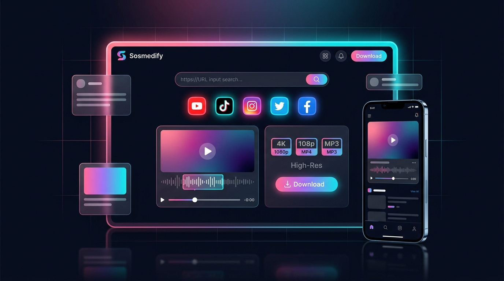

<div align="center">

  

  <br/><br/>

  <h1>🌿「 ソスメディファイ 」・ 𝐒 𝐎 𝐒 𝐌 𝐄 𝐃 𝐈 𝐅 𝐘 🌸</h1>

  <p align="center">
    <strong>Universal Social Media Video Extractor & Frame-Accurate Audio/Video Trimmer</strong><br/>
    <em>風のように速く、水のように澄み渡る — Selembut semilir angin musim semi, sejernih air pegunungan.</em>
  </p>

  <p align="center">
    
    
    
    
    
    
  </p>

  <p align="center">
    <a href="#-fitur-utama--特徴">Fitur Utama</a> •
    <a href="#-7-alam-sosial-media--対応プラットフォーム">7 Platform</a> •
    <a href="#-aplikasi-android-apk--モバイルアプリ">Aplikasi Android</a> •
    <a href="#-panduan-deploy-production--デプロイ">Deploy Production</a> •
    <a href="#-menjalankan-di-taman-lokal--開発環境">Lokal Dev</a>
  </p>

  <hr style="border: 0; height: 1px; background: linear-gradient(to right, transparent, #10B981, #EC4899, transparent); margin: 24px 0;" />

</div>

---

## 🍃 Tentang Sosmedify • 概要

**Sosmedify** adalah platform all-in-one berkinerja tinggi untuk mengunduh, memotong klip video (*frame-accurate trim*), dan mengekstrak audio berkualitas studio dari **7 platform media sosial terbesar di dunia**.

Dibangun dengan arsitektur modern yang memadukan keindahan antarmuka web, ketangguhan mesin Python FFmpeg di cloud, serta kepraktisan **Aplikasi Android dengan fitur Live Web Sync** yang otomatis terbarukan setiap kali ada pembaruan di website.

```
                  ┌─────────────────────────────────────────┐
                  │   🌸 Sosmedify Web UI (React + Vite)   │
                  │   📱 Android App (Live Web Sync APK)    │
                  └────────────────────┬────────────────────┘
                                       │ HTTP / REST
                                       ▼
                  ┌─────────────────────────────────────────┐
                  │    🌿 FastAPI Cloud Gateway (Railway)    │
                  │   ├── yt-dlp Multi-Tier Client Bypass   │
                  │   ├── FFmpeg Frame-Accurate Proxy       │
                  │   └── Auto Cleanup Temp Media Stream    │
                  └─────────────────────────────────────────┘
```

---

## 🌸 Fitur Utama • 特徴

- **🍃 7 Ekosistem Media Sosial**: Ekstraksi instan dari TikTok, Douyin, Instagram, Facebook, X (Twitter), RedNote (Xiaohongshu), dan YouTube.
- **✨ Frame-Accurate Trimming**: Potong klip video dengan presisi milidetik menggunakan engine FFmpeg stream proxy tanpa penurunan kualitas (*lossless precision*).
- **🎶 Studio Quality MP3 (320k)**: Opsi konversi satu sentuhan ke format audio MP3 beresolusi tinggi.
- **📱 Aplikasi Android Live Sync**: Aplikasi Android mandiri yang selalu sinkron dengan website secara *real-time* tanpa perlu menginstal ulang file APK jika ada update.
- **🎋 Monetisasi Siap Pakai**: Widget iklan Adsterra (*Leaderboard 728x90*, *Mobile 300x250*, & *Native Banner*) yang diisolasi aman dalam `iframe srcDoc`.
- **🌙 Zen Dark Theme**: Desain estetik modern bertema malam dengan palet warna neon lembut yang memanjakan mata pengguna.

---

## ⛩️ 7 Alam Sosial Media • 対応プラットフォーム

| Platform | Wilayah | Metode Ekstraksi & Bypass | Format Didukung |
| :--- | :---: | :--- | :---: |
| **TikTok** | 🌐 Global | TikWM API / Native yt-dlp (Tanpa Watermark) | `MP4` • `MP3` |
| **Douyin (抖音)** | 🇨🇳 Tiongkok | TikWM & Canonical Shared URL Extractor | `MP4` • `MP3` |
| **Instagram** | 🌐 Global | Graph API / Multi-Cookie Stream Extractor | `MP4` • `MP3` |
| **Facebook** | 🌐 Global | Watch & Public Reels Stream Parser | `MP4` • `MP3` |
| **X / Twitter** | 🌐 Global | Direct Video CDN Stream Decoupler | `MP4` • `MP3` |
| **RedNote (小紅書)** | 🇨🇳 Global | Desktop SSR & Direct CDN Tokenizer (0.3s) | `MP4` • `MP3` |
| **YouTube** | 🌐 Global | `android_vr` Anti-Bot Cloud Datacenter Bypass | `1080p` • `720p` • `MP3` |

---

## 📱 Aplikasi Android (APK) • モバイルアプリ

Sosmedify dilengkapi dengan proyek aplikasi Android native lengkap di dalam direktori terisolasi [`android-app/`](file:///c:/Users/user/OneDrive/Dokumen/ALL%20sosmed%20by%20dav'site/android-app).

> [!TIP]
> **Keunggulan Live Web Sync**:
> Aplikasi Android memuat website live Anda secara langsung. Setiap pembaruan yang Anda terapkan di website (Vercel) akan **langsung otomatis muncul di smartphone pengguna**, tanpa perlu mengunduh atau menginstal ulang file APK!

### ⚡ Fitur Utama Aplikasi Mobile
- **🍃 Native Video & Audio Downloader**: Tombol download terhubung langsung dengan Android `DownloadManager`. File video MP4 dan audio MP3 langsung tersimpan ke folder `Download/` dan otomatis terdeteksi di Galeri HP.
- **🔄 Pull-to-Refresh**: Usap layar ke bawah untuk memperbarui tampilan web secara cepat.
- **🛡️ Hardware Back Navigation**: Tombol kembali fisik/gesture Android menavigasi riwayat web, dan memerlukan konfirmasi tekan 2x untuk keluar dari aplikasi.
- **🌙 Layar Offline Zen**: Menampilkan antarmuka offline bernuansa gelap yang elegan dengan tombol *Coba Lagi* ketika ponsel kehilangan sinyal internet.

---

### ⚙️ Konfigurasi URL Website

Buka file [`android-app/app/src/main/res/values/strings.xml`](file:///c:/Users/user/OneDrive/Dokumen/ALL%20sosmed%20by%20dav'site/android-app/app/src/main/res/values/strings.xml):

```xml
<!-- Ganti dengan URL domain live website Vercel Anda -->
<string name="web_url">https://sosmedify.vercel.app</string>
```

---

### 🛠️ Cara Menghasilkan File APK

Tersedia 3 opsi praktis untuk mem-build file APK:

#### 🌟 Opsi 1: Build Otomatis di Cloud (GitHub Actions — Gratis & Tanpa Install Apapun)
Alur kerja otomatis telah disiapkan di [`.github/workflows/build-apk.yml`](file:///c:/Users/user/OneDrive/Dokumen/ALL%20sosmed%20by%20dav'site/.github/workflows/build-apk.yml):
1. Buka tab **[Actions](https://github.com/davsite/sosmedify/actions)** di repository GitHub Anda.
2. Di menu sebelah kiri, klik **Build Sosmedify APK** → klik tombol **Run workflow** → pilih branch `main` → klik **Run workflow**.
3. Tunggu proses build selesai (±2–3 menit).
4. Setelah bercentang hijau, klik run workflow tersebut, scroll ke bawah ke bagian **Artifacts**.
5. Unduh paket **`Sosmedify-App-Debug`** yang berisi file **`app-debug.apk`** siap pasang di HP!

#### 💻 Opsi 2: Menggunakan Android Studio (PC / Laptop)
1. Buka software **Android Studio** → pilih **File** → **Open...**.
2. Arahkan ke folder [`android-app/`](file:///c:/Users/user/OneDrive/Dokumen/ALL%20sosmed%20by%20dav'site/android-app) dan tunggu proses Gradle Sync selesai.
3. Klik menu **Build** → **Build Bundle(s) / APK(s)** → **Build APK(s)**.
4. Klik tautan notifikasi **locate** untuk mengambil file APK.

#### 💻 Opsi 3: Menggunakan Command Line
Jika komputer Anda sudah terpasang JDK 17+ dan Android SDK:
```bash
cd android-app
# Windows:
.\gradlew.bat assembleDebug

# Linux / Mac:
./gradlew assembleDebug
```
File APK akan berada di: `android-app/app/build/outputs/apk/debug/app-debug.apk`.

---

## 🏮 Panduan Deploy Production • デプロイ

### 🟢 Tahap 1: Deploy Backend ke Railway (Docker)
Backend Python FastAPI berjalan di atas Docker container mandiri:

1. Kunjungi [Railway.app](https://railway.app) dan hubungkan akun GitHub Anda.
2. Klik **New Project** → **Deploy from GitHub repo** → pilih `sosmedify`.
3. Railway otomatis mendeteksi [`Dockerfile`](file:///c:/Users/user/OneDrive/Dokumen/ALL%20sosmed%20by%20dav'site/Dockerfile) & [`railway.json`](file:///c:/Users/user/OneDrive/Dokumen/ALL%20sosmed%20by%20dav'site/railway.json).
4. Di tab **Settings** → klik **Generate Domain** (contoh: `https://sosmedify-production.up.railway.app`).
5. Periksa status kesehatan API:
   ```bash
   curl https://<domain-railway-kamu>/api/health
   # Respons: {"status":"HEALTHY","app_name":"Sosmedify Converter Service"}
   ```

---

### 🌸 Tahap 2: Deploy Frontend ke Vercel (React + Vite)
1. Buka [Vercel](https://vercel.com) dan impor repository `sosmedify`.
2. Pada bagian konfigurasi:
   - **Framework Preset**: `Vite`
   - **Root Directory**: `frontend`
   - **Build Command**: `npm run build`
   - **Output Directory**: `dist`
3. Tambahkan **Environment Variable**:
   - `VITE_API_URL` = `https://<domain-railway-kamu>` *(tanpa tanda slash / di ujung)*
4. Klik **Deploy**. Webapp Anda langsung aktif di `https://<nama-project>.vercel.app`!

---

## 🎋 Menjalankan di Taman Lokal • 開発環境

Jika Anda ingin mengembangkan atau menguji fitur baru di komputer lokal:

### 1. Backend Service (Python 3.12+ & FFmpeg)
```bash
cd backend
pip install -r requirements.txt
uvicorn main:app --host 0.0.0.0 --port 8000 --reload
```
Dokumentasi interaktif Swagger UI dapat dibuka di: `http://localhost:8000/docs`.

### 2. Frontend Interface (Node.js 18+)
```bash
cd frontend
npm install
npm run dev
```
Tampilan web akan aktif di: `http://localhost:5173`.

---

## 🌊 Keamanan & Pembersihan Otomatis • セキュリティ

> [!NOTE]
> - **Pembersihan Berkelanjutan**: Seluruh berkas hasil download/trim yang disimpan sementara di `/temp_media` akan dihapus secara otomatis segera setelah file berhasil dialirkan ke pengguna (*Starlette BackgroundTask*).
> - **Chunk Range Streaming**: Endpoint `/api/stream` mendukung HTTP 206 Partial Content untuk pemutaran video preview instan tanpa perlu menunggu seluruh berkas terunduh.

---

<div align="center">

  <br/>
  <p>🍃 <em>Dibuat dengan cinta, ketenangan alam, dan baris kode yang harmonis.</em> 🌸</p>
  <p><strong>Sosmedify by Dav'site</strong> • © 2026</p>

  

</div>
